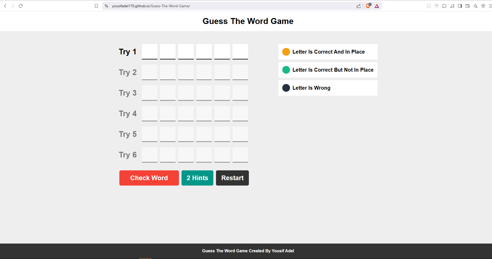
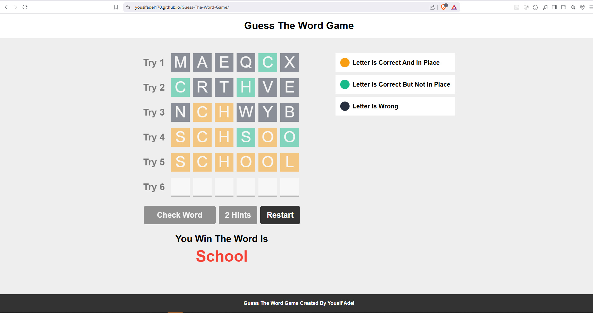
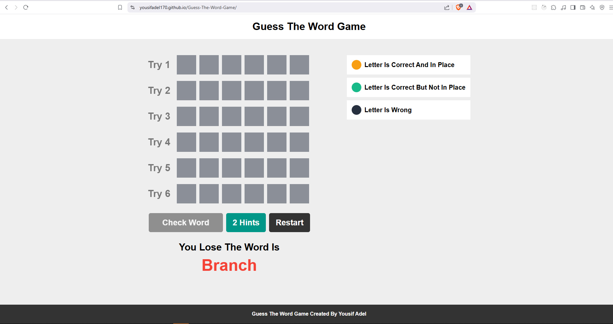

# 📝 Guess-The-Word Game

A fun and interactive browser-based "Guess The Word" game where players try to guess a hidden word within a limited number of attempts. Built with **vanilla JavaScript, HTML, and CSS**, this lightweight game offers an engaging word puzzle experience.

## 🔗 Live Demo

[Play Guess-The-Word Online](https://youssefadel170.github.io/Guess-The-Word-Game/)

---

## 🎯 Game Features

### Word Guessing Mechanics

- Players have a fixed number of tries to guess a six-letter word.
- Letters are color-coded after each attempt to provide hints:
  - **🟩 Green:** Correct letter in the correct position
  - **🟨 Yellow:** Correct letter in the wrong position
  - **🟥 Red:** Incorrect letter

### Hints

- Reveal one letter using hints.
- Limited hints available; using a hint decreases your remaining tries.

### User-Friendly Input

- Auto-focus moves to the next input box as players type.
- Arrow key navigation and backspace handling across inputs.

### Restart Functionality

- Start a new game after winning or losing with a different word.

---

## 🕹 How to Play

1. **Enter Your Guess:** Type one letter in each box to form a word.
2. **Submit the Guess:** Click the "Check" button.
3. **Use Hints Wisely:** Click the "Hint" button to reveal a letter (limited uses).
4. **Win or Try Again:** Guess the word within allowed attempts to win; otherwise, the correct word is revealed.

---

## 🛠 Built With

- **JavaScript:** Game logic, input handling, validations, hints, win/lose conditions
- **HTML & CSS:** Responsive layout and styling

---

## 🚀 Getting Started

### Prerequisites

- Any modern web browser

### Installation

1. Clone the repository:

```bash
git clone git@github.com:YousifAdel170/Guess-The-Word-Game.git
```

2. **Navigate into the project directory**
   ```bash
   cd Guess-The-Word-Game
   ```
3. Open **index.html** in your browser.

### 📸 Screenshots

- **Game:**  
  

- **Win:**  
  

- **Lose:**  
  
